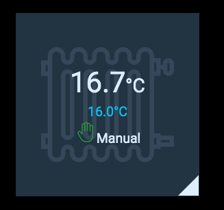
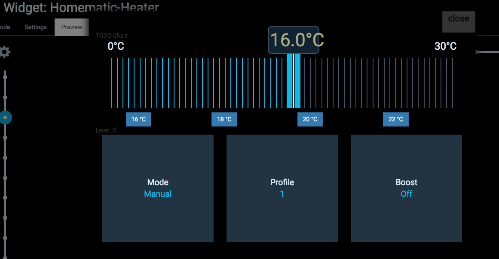
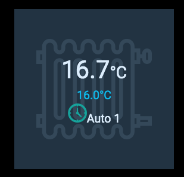

# iobroker.habpanel.widgets
Homematic based widgets for habpanel running in iobroker

## Homematic-Heater-Widget
* displays current and target temperature
* configurable quick buttons to select a temperature
* Auto/manual mode icons
* large slider, better for touch screens
* mode switching, profile switching

Some examples:

